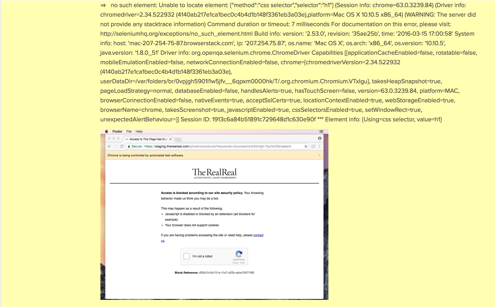

## Test Cases

[You can view the test cases I created here](https://docs.google.com/spreadsheets/d/1_4eFOomnWZ-A4ePlDVvpJty_qtqCZxQi8FLAA5WSO5s/edit?usp=sharing)

## Installation

1. Install selenium-cucumber

        gem install selenium-cucumber

2. Run the tests

        cucumber

## Assumptions

I assume the data in the database is always known and can be controlled. Product information does not change.

I assume the API test suite is robust. I assume search, filter, and sort are covered by API tests so not all permutations need to be tested with front end tests.

## Other Notes

I planned on using the selenium-cucumber-ruby library but the library made the steps harder to read so I only use part of it.

I don't handle stale element exceptions with this project. They sometimes appear when running the tests but fixing this is outside the scope of the project. I have fixed this for the python webdriver before so I know how to do it.

I tried to use browserstack to run the tests but was encountering an access error since the website knew I was a bot.

